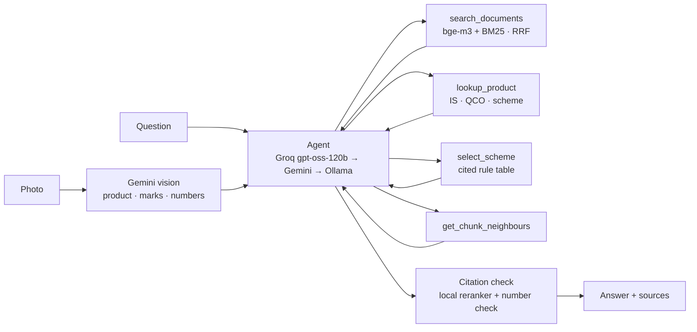

<div align="center">

# BIS Assistant

### Answers from official BIS documents, with proof.

An AI assistant for **Indian Standards and BIS services**: the BIS Act, Rules and Regulations, product certification (ISI / Scheme I, CRS / Scheme II, FMCS, Scheme IV / X), Quality Control Orders (QCOs), hallmarking and consumer matters.
**Every answer cites official BIS documents, with page links.**


🏆 **Built for Smart India Hackathon 2026: Problem Statement SIH26107**
*AI-powered Intelligent Assistant for Indian Standards & BIS Services*


<!-- 🎥 Demo video: add the YouTube link here when ready -->

</div>

> **📌 Why this repo appeared recently:** the project was developed in a **private repository during the hackathon** to keep our solution confidential while the competition was running. It has been made public now so others can learn from it and build on it. The commit history reflects the work done during that period.

---

## Contents

[The problem](#the-problem) · [Our solution](#our-solution) · [See it in action](#see-it-in-action) · [Features](#features) · [How it works](#how-it-works) · [Tech stack](#tech-stack) · [Results](#results) · [Setup](#setup) · [Run](#run) · [Test and evaluate](#test-and-evaluate) · [Project layout](#project-layout) · [Limits and roadmap](#limits-and-roadmap) · [Team](#team)

---

## The problem

India has **20,000+ Indian Standards** and **hundreds of Quality Control Orders** that make certification compulsory for specific products. A manufacturer, importer or consumer who asks *"Which standard applies to my product? Is certification compulsory? Which scheme, and what are the steps?"* has to dig through **6+ BIS portals** and long legal PDFs.

General AI chatbots answer **from memory**, so they miss new QCOs and amendments. They **make up** section numbers, fees and dates, and they **can't show where** an answer came from.

## Our solution

BIS Assistant is built on **retrieval-augmented generation (RAG)**:

1. Documents are downloaded from bis.gov.in.
2. They are split into cited chunks.
3. At question time, the relevant chunks are searched and the answer is written only from them.

When the rules change (new QCOs, amendments), you **re-download and re-index; no retraining needed.**

| General AI chatbot | BIS Assistant |
|---|---|
| Answers from training memory | Answers from **~550 official BIS documents** |
| May invent section numbers, fees, dates | **Every fact cited** with title, section, page, URL |
| No proof | **"How I answered"** shows the sources and steps |
| Always gives an answer | Says **"not covered"** and gives official links |
| Text only | Reads **product photos** too |

## See it in action

### Ask in plain words

> **You:** I make stainless-steel water bottles. Which standard applies?
>
> **BIS Assistant:** **IS 17803:2022** applies, and BIS certification is **compulsory** under the Potable Water Bottles (Quality Control) Order. You need an **ISI licence under Scheme I**. [1][2]
>
> **You:** and the fee?
>
> **BIS Assistant:** *(remembers: steel bottles, IS 17803, Scheme I)* …

### Check a product from a photo

Upload a photo of a product or its box. The assistant identifies the product and any certification marks, finds the applicable standard and scheme, and explains how to apply or verify.


What happens in this example:

1. **Photo uploaded:** wireless on-ear headphones (box front).
2. **What I see in your photo:** the product type, and no certification mark visible on this side.
3. **Standard found:** **IS/IEC 62368 Part 1:2023**, compulsory under **Scheme II (CRS)**, cited to the BIS Scheme II product list.
4. **Follow-up "where should I apply and process?":** answered with the CRS registration portal and the step-by-step process. It remembers the product from the photo, so the user doesn't repeat it.
5. **Copy, "How I answered" and response time** are shown under every answer.

## Features

| | Feature | What it does |
|---|---|---|
| 📚 | **Answers with citations** | Every fact ends with `[n]`; the source list gives title, section, page and URL. A local checker removes any sentence its source doesn't support |
| 🧭 | **Advises** | Works out who you are (manufacturer, importer, jeweller, consumer) and what you want, then answers as an action plan, steps, a comparison table or a problem-solving guide |
| 🔎 | **Recommends standards** | Describe a product → Indian Standard(s), compulsory or not, the QCO (S.O. number, date), the scheme |
| 🗂️ | **Selects the scheme** | Scheme I, FMCS, CRS or Hallmarking, with the rule that decides it and next steps, each backed by a document |
| 📷 | **Photo check** | Reads the product, ISI / CRS / hallmark marks, licence number or HUID; checks number formats in code; explains how to verify on the BIS CARE app |
| 🤖 | **Reasoning agent** | Plans, calls tools (search, product lookup, scheme selection, neighbouring text), checks for gaps, then answers |
| 🧠 | **Conversation memory** | Follow-up questions work without repeating your product |
| 🚫 | **Honest refusals** | If the documents don't cover something, it says so and gives official links; never answers from model memory |
| 🌐 | **English and Hindi** | |

## How it works



```
question
  └─ agent (Groq gpt-oss-120b → Gemini → local Ollama)
       ├─ search_documents   hybrid search: bge-m3 vectors (Qdrant) + BM25, reciprocal rank fusion
       ├─ lookup_product     product index: IS number, QCO, scheme, compulsory status
       ├─ select_scheme      rule table (app/scheme_rules.yaml), every rule cites its source chunk
       └─ get_chunk_neighbours
  └─ citation check (local reranker + number check) → answer + sources
```

**Knowledge base:** **3,600+ chunks** from about **550 official documents**, plus **995 products** from the BIS compulsory-certification lists. The documents include:

- the BIS Act 2016 and BIS Rules 2018
- the Conformity Assessment Regulations and their amendments
- grant, renewal and surveillance guidelines, and FAQs
- the hallmarking regulations and orders
- about 500 QCO PDFs

**Photo pipeline:** Gemini vision returns structured JSON (product, marks, CM/L, R-number, HUID, purity). Number formats are checked by plain code against rules taken from the BIS documents. Numbers from blurry photos are discarded, never guessed.

## Tech stack

| Part | Choice |
|---|---|
| LLM | Groq (`gpt-oss-120b`, `gpt-oss-20b`) → Google Gemini (model fallback chain) → local Ollama (`qwen2.5:3b`) |
| Vision | Gemini vision, structured JSON output |
| Embeddings | `bge-m3` via Ollama (local, free, Hindi + English) |
| Vector DB | Qdrant, embedded mode (no server) |
| Keyword search | `rank_bm25` (exact IS / S.O. numbers) |
| Reranker | `BAAI/bge-reranker-base` (ONNX via `fastembed`, CPU) |
| Memory | SQLite session memory |
| PDF / HTML | PyMuPDF, httpx + BeautifulSoup |
| API | FastAPI (JSON and SSE streaming) |

## Results

| Test | Result |
|---|---|
| Basic questions (test paper, section A) | **19 / 20** |
| Off-topic refusals (section J) | **4 / 4** |
| Photo check (10 test images) | **9 / 10** (blurry-image case fixed afterwards) |
| Automated tests | **69 passing** |

*Question sets, eval runners and reports are in [`eval/`](eval/).*

## Setup

Needs Python 3.11+ and [Ollama](https://ollama.com).

```bash
git clone https://github.com/Prateek-Mali/bis-assistant.git
cd bis-assistant
python3 -m venv .venv
.venv/bin/pip install -r requirements.txt
ollama pull bge-m3
ollama pull qwen2.5:3b          # offline fallback model
cp .env.example .env            # then add your keys
```

Keys in `.env`:
- `GROQ_API_KEY`: free at https://console.groq.com/keys
- `GEMINI_API_KEY` (optional `GEMINI_API_KEY_2`): free at https://aistudio.google.com/apikey

### Build the knowledge base

```bash
.venv/bin/python scripts/download.py --priority 1   # official sources from data/sources.yaml (2 s delay, robots.txt)
.venv/bin/python scripts/parse.py                   # PDF/HTML → text with page numbers
.venv/bin/python scripts/chunk.py                   # structure-aware chunks → data/processed/chunks.jsonl
.venv/bin/python scripts/build_index.py             # bge-m3 vectors + BM25
.venv/bin/python scripts/build_product_index.py     # product index for the recommender
```

To re-download and re-index everything later: `bash scripts/refresh.sh`.
Documents the BIS server refuses (HTTP 403) are listed in `data/MISSING_DOCS.md`. Put them in `data/manual/` and re-index.

> Official BIS PDFs are **not stored in this repository** (BIS copyright). They are downloaded from bis.gov.in using `data/sources.yaml`.

## Run

Terminal chat (`/trace` shows how it answered; `/image <path>` checks a photo):
```bash
.venv/bin/python ui/chat_cli.py
```

API server:
```bash
.venv/bin/uvicorn app.api:app --port 8000
```

| Endpoint | What it does |
|---|---|
| `POST /chat` | `{message, session_id}` (+ optional image) → answer, citations, sources, provider, latency |
| `POST /chat/stream` | same, as Server-Sent Events |
| `POST /recommend` | `{description}` → candidate Indian Standards (IS, compulsory, QCO, scheme) |
| `POST /scheme` | `{profile}` → scheme, why, next steps, sources |
| `POST /search` | raw retrieval results (for debugging) |
| `GET /health`, `GET /sources` | status, and the list of indexed documents |
| `POST /admin/reindex` | re-parse, re-chunk and re-index in the background |

Set `AGENT_MODE=off` in `.env` to use the simpler linear pipeline. The agent also falls back to it automatically if it fails, so the demo never breaks.

**Try these:**

```text
What is BIS?
I make stainless-steel water bottles. Which standard applies, and is it compulsory?
I import LED bulbs from China. What do I need?
BIS raised objections on my application. How long do I have to respond?
How do I check whether my gold jewellery's HUID is genuine?
/image data/test_images/synthetic/07_isi_helmet.png "Is this legal to sell?"
```

## Test and evaluate

```bash
.venv/bin/python -m pytest tests          # unit tests + recommender cases (need Ollama)
.venv/bin/python eval/quick_eval.py       # 10 questions, local scoring, one line each
.venv/bin/python eval/run_eval.py         # full question set → eval/report.md
.venv/bin/python eval/vision_eval.py      # photo check on test images
```

Tools for inspecting the knowledge base:
- `scripts/chunk_report.py`: chunk statistics report.
- `scripts/embedding_map.py`: an interactive 2D map of the vectors with a search box.
- `scripts/knowledge_graph.py`: an interactive graph of documents and chunks.
- `scripts/export_obsidian.py`: exports the knowledge base as an Obsidian vault.
- `scripts/debug_search.py "question"`: shows what retrieval returns for a question.

## Project layout

```
app/        agent, answer pipeline, retrieval, recommender, scheme rules, vision, prompts, LLM providers, API
scripts/    download, parse, chunk, index, product index, inspection tools
data/       sources.yaml, product tables (structured/), download log, manual uploads
eval/       question sets, eval runners, reports
tests/      pytest suite
ui/         terminal chat, web UI
docs/       demo GIF and screenshots
```

## Limits and roadmap

**Limits**
- Answers are information, not legal advice. Rules change often, so confirm the latest on https://www.bis.gov.in.
- Some official PDFs are scanned and still need OCR; some BIS links return 403 (see `data/MISSING_DOCS.md`).
- The assistant never verifies a licence, HUID or R-number itself; it points to the BIS CARE app.
- Photo reading is tested mainly on synthetic images; a photo answer takes about 30 s.

**Next**
- [ ] Testing-lab finder (by IS number and state)
- [ ] Related-standards suggestions
- [ ] Faster photo answers (target under 20 s)
- [ ] Weekly automatic refresh of new QCOs and amendments

## Team

| Name | Role |
|---|---|
| **Prateek Mali** · [@Prateek-Mali](https://github.com/Prateek-Mali) | AI/ML: RAG engine, agent, vision |
| *Teammate name* | Web development |
| *Teammate name* | Data and evaluation |

## Disclaimer

**Not an official BIS service.** BIS Assistant is a student project built for Smart India Hackathon 2026 (SIH26107). Its answers are for information only and are not legal advice. Always confirm requirements on [bis.gov.in](https://www.bis.gov.in) or with BIS.

## License

Released under the [MIT License](LICENSE).
