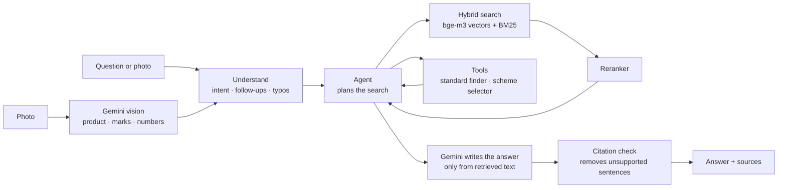

<div align="center">

# BIS Assistant

### Answers from official BIS documents, with proof.

An AI assistant for **Indian Standards, BIS certification (ISI · CRS · FMCS), Quality Control Orders and hallmarking**.
Every fact it gives is cited to the official BIS document and page it came from.


🏆 **Built for Smart India Hackathon 2026: Problem Statement SIH26107**
*AI-powered Intelligent Assistant for Indian Standards & BIS Services*


🎥 **[Watch the demo video](#)** · 🌐 **Live demo:** coming soon

</div>

> **📌 Why this repo appeared recently:** the project was developed in a **private repository during the hackathon** to keep our solution confidential while the competition was running. It has been made public now so others can learn from it and build on it. The commit history reflects the work done during that period.

---

## Contents

- [The problem](#the-problem)
- [Our solution](#our-solution)
- [See it in action](#see-it-in-action)
- [Features](#features)
- [How it works](#how-it-works)
- [Tech stack](#tech-stack)
- [Results](#results)
- [Run it locally](#run-it-locally)
- [Project structure](#project-structure)
- [Limitations and roadmap](#limitations-and-roadmap)
- [Team](#team)
- [Disclaimer](#disclaimer)

---

## The problem

India has **20,000+ Indian Standards** and **hundreds of Quality Control Orders (QCOs)** that make certification compulsory for specific products. A small manufacturer, an importer or an ordinary consumer who asks:

- *"Which standard applies to my product?"*
- *"Is BIS certification compulsory for it?"*
- *"Which scheme do I apply under, and what are the steps?"*
- *"Is the hallmark on my gold genuine?"*

has to dig through **6+ BIS portals** and long legal PDFs.

General AI chatbots don't solve this. They answer **from memory**, so they miss new QCOs and amendments. They **make up** section numbers, fees and dates, and they **can't show where** an answer came from.

## Our solution

**BIS Assistant reads the official BIS documents first, then answers from them.** Every fact carries a citation, and when something isn't in the documents it says so honestly instead of guessing.

| General AI chatbot | BIS Assistant |
|---|---|
| Answers from training memory | Answers from **586 official BIS documents** |
| May invent section numbers, fees, dates | **Every fact cited** to document + page |
| No proof | **"How I answered"** shows the sources used |
| Always gives an answer | Says **"not covered"** when the documents don't cover it |
| Text only | Reads **product photos** too |

## See it in action

### Ask in plain words

> **You:** I make stainless-steel water bottles. Which standard applies?
>
> **BIS Assistant:** **IS 17803:2022** applies, and BIS certification is **compulsory** under the Potable Water Bottles (Quality Control) Order. You need an **ISI licence under Scheme I**. [1][2]
>
> **You:** and the fee?
>
> **BIS Assistant:** *(remembers: steel bottles, IS 17803, Scheme I)* …


### Check a product from a photo

Upload a photo. The assistant identifies the product and any certification marks, finds the applicable standard and scheme, and explains how to apply or verify.


> *Photo of wireless headphones → identified the product → **IS/IEC 62368 Part 1:2023**, compulsory under **Scheme II (CRS)** → follow-up "where should I apply?" answered with the CRS portal and step-by-step process, all cited.*

<details>
<summary>More screenshots</summary>

| Home | Follow-up with memory | "How I answered" |
|---|---|---|
|  |  |  |

</details>

## Features

| | Feature | What it does |
|---|---|---|
| 📚 | **Cited answers** | Every fact links to the official BIS document and page |
| 🔎 | **Standard finder** | Describe a product in plain words → IS number, compulsory or not, QCO, scheme |
| 🧭 | **Scheme guide** | Indian or foreign maker + product type → ISI (Scheme I), CRS (Scheme II), FMCS or Hallmarking, with the reason |
| 📋 | **Process guidance** | Licence steps, documents, fees, timelines, objections, renewal, change in scope |
| 📷 | **Photo check** | Reads the product, ISI / CRS / hallmark marks, licence number or HUID; checks the number format; explains how to verify on the BIS CARE app |
| 💍 | **Consumer & hallmarking help** | HUID checks, purity grades, compensation rules, how to complain about fake marks |
| 🧠 | **Conversation memory** | Follow-up questions work without repeating your product |
| 🚫 | **Honest refusals** | Says "not covered" instead of guessing; declines off-topic questions |

## How it works

BIS Assistant is an **Agentic RAG** system (Retrieval-Augmented Generation driven by an AI agent):



1. **Knowledge base:** 586 official BIS files, including:
   - the BIS Act 2016 and BIS Rules 2018
   - the Conformity Assessment Regulations 2018 and their amendments
   - certification guidelines and FAQs
   - 557 QCOs
   - the hallmarking rules

   Together they make about 3,600 searchable chunks.
2. **Hybrid search:** meaning-based search (bge-m3 embeddings) plus keyword search (BM25, so exact IS numbers are found), fused and then reranked.
3. **Agent:** plans the search, calls tools, and searches again when something is missing.
4. **Grounded generation:** the LLM may use only the retrieved text, and every fact gets a citation.
5. **Citation check:** each sentence is checked against its source; unsupported sentences are removed.
6. **Photo pipeline:** Gemini vision returns structured JSON. Number formats (HUID, CRS R-number, CM/L) are checked by plain code against rules taken from the BIS documents. Numbers in blurry photos are discarded, never guessed.

## Tech stack

| Layer | Technology |
|---|---|
| LLM | Google **Gemini** (Flash), with Groq and Ollama as fallbacks |
| Vision | Gemini vision, structured JSON output |
| Embeddings | **BAAI bge-m3** (runs locally) |
| Vector database | **Qdrant** |
| Keyword search | BM25 + Reciprocal Rank Fusion |
| Reranker | BAAI bge-reranker (local cross-encoder) |
| Agent | Tool-calling agent loop |
| Memory | SQLite session memory |
| Document processing | PyMuPDF + OCR |
| Backend | Python · FastAPI |
| Frontend | Web chat UI with source cards and photo upload |

## Results

| Test | Result |
|---|---|
| Basic questions (test paper, section A) | **19 / 20** |
| Off-topic refusals (section J) | **4 / 4** |
| Photo check (10 test images) | **9 / 10** (blurry-image case fixed afterwards) |
| Automated tests | **69 passing** |

*The full test paper (60 questions) and the evaluation scripts are in [`eval/`](eval/).*

## Run it locally

**Requirements:** Python 3.11+, [Ollama](https://ollama.com) (for local embeddings), a [Gemini API key](https://aistudio.google.com/apikey).

```bash
git clone https://github.com/Prateek-Mali/bis-assistant.git
cd bis-assistant
python -m venv .venv && source .venv/bin/activate
pip install -r requirements.txt

cp .env.example .env            # add your GEMINI_API_KEY
ollama pull bge-m3              # local embedding model

bash scripts/refresh.sh         # download official BIS documents + build the index
python ui/chat_cli.py           # chat in the terminal
uvicorn app.api:app --reload    # or run the API
```

> Official BIS PDFs are **not stored in this repository** (BIS copyright). `scripts/download.py` fetches them from bis.gov.in using the list in `data/sources.yaml`.

**Try these:**

```text
What is BIS?
I make stainless-steel water bottles. Which standard applies, and is it compulsory?
I import LED bulbs from China. What do I need?
BIS raised objections on my application. How long do I have to respond?
How do I check whether my gold jewellery's HUID is genuine?
/image data/test_images/synthetic/07_isi_helmet.png "Is this legal to sell?"
```

## Project structure

```text
bis-assistant/
├── app/            # answer pipeline, agent, retrieval, tools, vision, API
├── scripts/        # download, parse, chunk, build index
├── data/
│   ├── sources.yaml        # list of official BIS sources
│   └── structured/         # product → IS → QCO tables
├── eval/           # test paper, held-out set, evaluation scripts
├── ui/             # terminal chat + web UI
└── tests/          # automated tests
```

## Limitations and roadmap

**Limitations**
- Answers only from documents in its knowledge base; brand-new notifications appear after the next refresh.
- It never verifies a licence or HUID itself; it points to the official **BIS CARE** app.
- Photo reading is tested mainly on synthetic images; real-photo accuracy is still being measured.
- A photo answer takes about 30 s.

**Next**
- [ ] Testing-lab finder (by IS number and state)
- [ ] Related-standards suggestions
- [ ] Faster photo answers (target under 20 s)
- [ ] Weekly automatic refresh of new QCOs and amendments

## Team

| Name | Role |
|---|---|
| **Prateek Mali** · [@Prateek-Mali](https://github.com/Prateek-Mali) | AI/ML: RAG engine, agent, vision |
| *Teammate name* | Web development |
| *Teammate name* | Data and evaluation |

## Disclaimer

**Not an official BIS service.** BIS Assistant is a student project built for Smart India Hackathon 2026. Its answers are for information only and are not legal advice. Always confirm requirements on [bis.gov.in](https://www.bis.gov.in) or with BIS.

## License

Released under the [MIT License](LICENSE).
